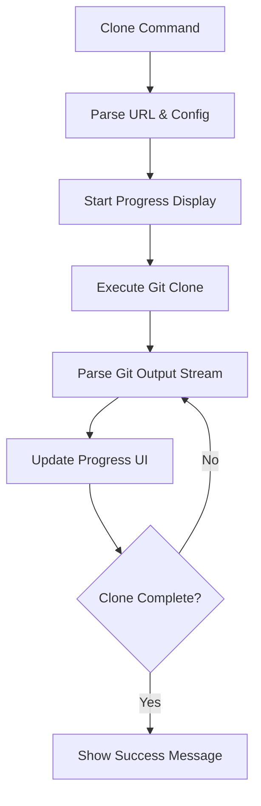

# Modern Clone Progress Display

## Problem

Currently, `gitr clone` shows only a simple "Cloning..." message without real-time progress updates. Users don't see:

- Percentage completion
- Object counts (enumerating, counting, compressing, receiving)
- Transfer speeds
- Current operation status

This makes long clones feel unresponsive compared to native `git clone`.

## Solution Architecture



The solution will:

1. **Add `charmbracelet/bubbles`** - For spinner animations during initial phases
2. **Stream git output parsing** - Extract progress info (percentages, counts, speeds) from git's stderr
3. **Live progress updates** - Display real-time status with styled progress indicators
4. **Support all clone methods** - SSH, HTTP, and HTTPS clones

## Implementation Plan

### 1. Add Dependencies

**File**: [`go.mod`](go.mod)

- Add `github.com/charmbracelet/bubbles` for spinner component
- Update go.mod with `go get github.com/charmbracelet/bubbles`

### 2. Create Progress Display Component

**New File**: `pkg/ui/progress.go`

- Create `CloneProgress` struct to manage progress state
- Parse git output patterns:
- "Enumerating objects: X, done."
- "Counting objects: X% (Y/Z)"
- "Compressing objects: X% (Y/Z)"
- "Receiving objects: X% (Y/Z), A.BB MiB | C.DD MiB/s"
- Display spinner + status for current operation
- Show percentage bars for operations with progress
- Use existing color palette from [`pkg/ui/styles.go`](pkg/ui/styles.go)

### 3. Update Clone Functions

**File**: [`pkg/clone/clone.go`](pkg/clone/clone.go)Modify three clone functions to stream output through progress parser:**`sshClone` (line 215)**:

- Already uses `exec.Command` with native git
- Pipe stderr/stdout through progress parser
- Update UI in real-time as output arrives

**`httpClone` (line 186)** and **`httpsGitClone` (line 197)**:

- Currently use go-git library with `Progress: os.Stdout`
- Replace with custom `io.Writer` that parses and displays progress
- go-git sends similar progress messages to git CLI

### 4. Replace Simple "Cloning" Message

**File**: [`pkg/ui/success.go`](pkg/ui/success.go)

- Keep `Cloning()` function (line 134) but make it return a progress tracker
- Replace static message with interactive progress display
- Clean up progress display before showing success message

## Example Output

Before (current):

```javascript
→  Cloning git@github.com:plantonhq/planton.git

(waits silently...)

✓  Repository cloned successfully
```

After (improved):

```javascript
↓  Cloning git@github.com:plantonhq/planton.git

   ⠋ Enumerating objects...
   ✓ Enumerating objects: 343614, done.
   ⠙ Counting objects: 45% (1256/2356)
   ✓ Counting objects: 100% (2356/2356), done.
   ⠹ Compressing objects: 78% (798/1018)
   ✓ Compressing objects: 100% (1018/1018), done.
   ⠸ Receiving objects: 67% (2915/4296), 611.48 MiB | 1.33 MiB/s
   ✓ Receiving objects: 100% (4296/4296), 819.89 MiB | 1.33 MiB/s, done.

✓  Repository cloned successfully
   ~/scm/github.com/plantonhq/planton
```


## Files Changed

- `go.mod` - Add bubbles dependency
- `pkg/ui/progress.go` (new) - Progress display logic
- `pkg/ui/styles.go` - Add progress-specific styles
- `pkg/clone/clone.go` - Wire progress display into clone functions
- `pkg/ui/success.go` - Update Cloning() function signature

## Benefits

- **Real-time feedback** - Users see exactly what's happening
- **Modern aesthetics** - Matches gitr's polished UI design